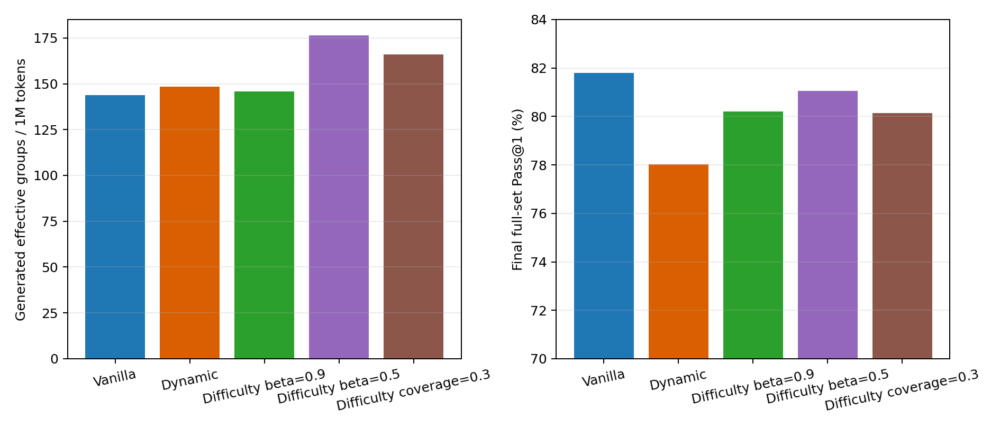
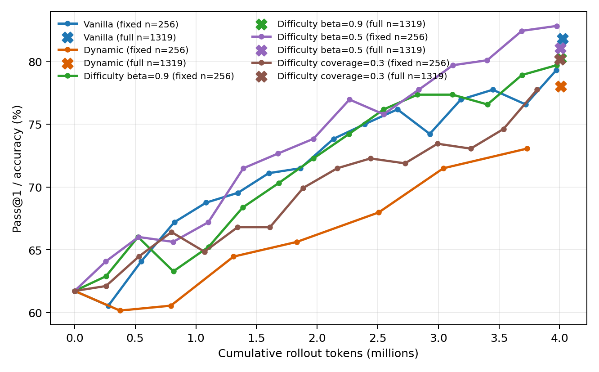

# Seed-42 Coverage Ablation

All five runs use Qwen2.5-Math-1.5B, raw GSM8K, group size 8, the same reward,
loss, generation settings, seed 42, and approximately four million rollout
tokens. This is a controlled sampler ablation, not a multi-seed accuracy
claim.

## Fixed-budget comparison

| Method | Zero variance | Effective groups / 1M tokens | Full Pass@1 |
|---|---:|---:|---:|
| Vanilla random | 52.38% | 143.90 | **81.80%** |
| Dynamic filtering | 50.08% | 147.65 | 78.01% |
| Difficulty, beta=0.9 | 48.23% | 145.69 | 80.21% |
| Difficulty, beta=0.5 | **37.41%** | **176.24** | 81.05% |
| Difficulty + coverage=0.3 | 43.54% | 165.96 | 80.14% |

The experiments now establish two separate failure modes:

1. Random GRPO increasingly samples all-correct groups and loses relative
   advantage signal.
2. Aggressive boundary sampling fixes that inefficiency but concentrates on
   only about 3% of training prompts.

The coverage term is a successful mechanism test: it increases measured
coverage from 3.18% to 6.78% while retaining a 15.33% effective-groups-per-token
advantage over Vanilla. It is not a successful accuracy intervention at
weight 0.3. Continuous coverage exploration places the run between Vanilla
and Fast EMA on rollout efficiency, but below both on final full-set accuracy.

## Research conclusion

- **H1 remains supported:** Vanilla's zero-variance fraction grows strongly
  and is dominated by all-correct prompts late in training.
- **H2 remains supported:** Dynamic filtering produces effective optimizer
  batches only after spending 44.36% of rollout tokens on discarded groups.
- **H3 is supported:** beta=0.5 Difficulty Sampling robustly improves the
  number of non-zero-variance groups generated per token.
- **H4 remains unsupported as a general claim:** higher signal efficiency has
  not translated into higher full-test accuracy.
- **Coverage sub-hypothesis is only partly supported:** the explicit bonus
  fixes sampler concentration, but fixed-weight exploration does not recover
  generalization.

The strongest project result is therefore a measured Pareto tradeoff between
rollout signal efficiency and prompt coverage, plus evidence that optimizing
only effective-group ratio is an incomplete RLVR sampling objective.

## Next experiment

Use a front-loaded coverage curriculum: sample 512 unique prompt groups for
warm-up, then use beta=0.5 boundary sampling with coverage weight 0 and the
same 10% uniform exploration. This changes only the exploration schedule and
directly tests the explanation above. It should be run first on seed 42 under
the same four-million-token budget; only if it beats the fixed coverage run
on both effective groups per token and full evaluation should it be replicated
across seeds.

