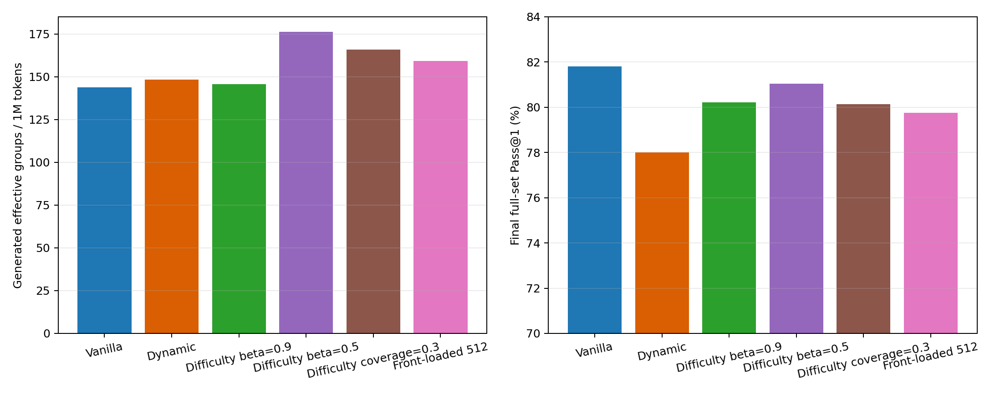
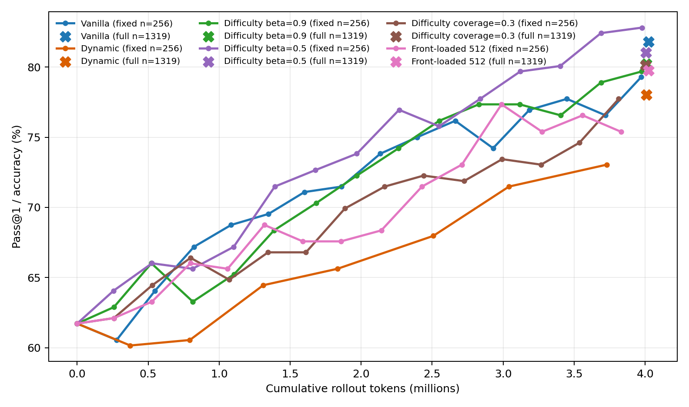

# Seed-42 Sampling and Coverage-Schedule Ablation

All runs use Qwen2.5-Math-1.5B, raw GSM8K, group size 8, identical reward and
GRPO settings, seed 42, and approximately four million rollout tokens.

## Complete comparison

| Method | Zero variance | Effective groups / 1M tokens | Full Pass@1 |
|---|---:|---:|---:|
| Vanilla random | 52.38% | 143.90 | **81.80%** |
| Dynamic filtering | 50.08% | 147.65 | 78.01% |
| Difficulty beta=0.9 | 48.23% | 145.69 | 80.21% |
| Difficulty beta=0.5 | **37.41%** | **176.24** | 81.05% |
| Fixed coverage=0.3 | 43.54% | 165.96 | 80.14% |
| Front-loaded coverage=512 | 45.49% | 159.26 | 79.76% |

The ablation traces a coherent mechanism:

1. Random sampling wastes late rollout on all-correct groups.
2. Post-generation filtering cannot recover the spent generation tokens.
3. A slow beta=0.9 history fails to track the changing policy.
4. Beta=0.5 restores tracking and produces the best signal efficiency.
5. Fixed coverage doubles diversity but dilutes boundary selection.
6. Front-loaded coverage expands the pool further, but long revisit intervals
   make histories stale again and consume 42% of the budget before focus.

## Current scientific claim

The robust positive result remains the three-seed Fast-EMA efficiency gain:
23.60% more effective groups per million rollout tokens than Vanilla, with
zero variance reduced in every seed. The robust negative result is that this
did not improve full-test accuracy; Fast EMA averaged 1.42 points below
Vanilla across three paired seeds.

The two seed-42 coverage ablations clarify rather than overturn that result.
They show that prompt concentration is measurable and controllable, but
neither a fixed coverage mixture nor a front-loaded unique-prompt curriculum
recovers accuracy. Efficient advantage generation and downstream
generalization are distinct objectives.

## Recommended stopping point

The front-loaded configuration should not receive multi-seed replication
because it failed the predeclared seed-42 screening criteria. The project now
has a complete evidence-backed narrative, including successful mechanisms and
falsified hypotheses. Further training should begin only for a newly specified
temporal-calibration method, not another arbitrary coverage coefficient.

