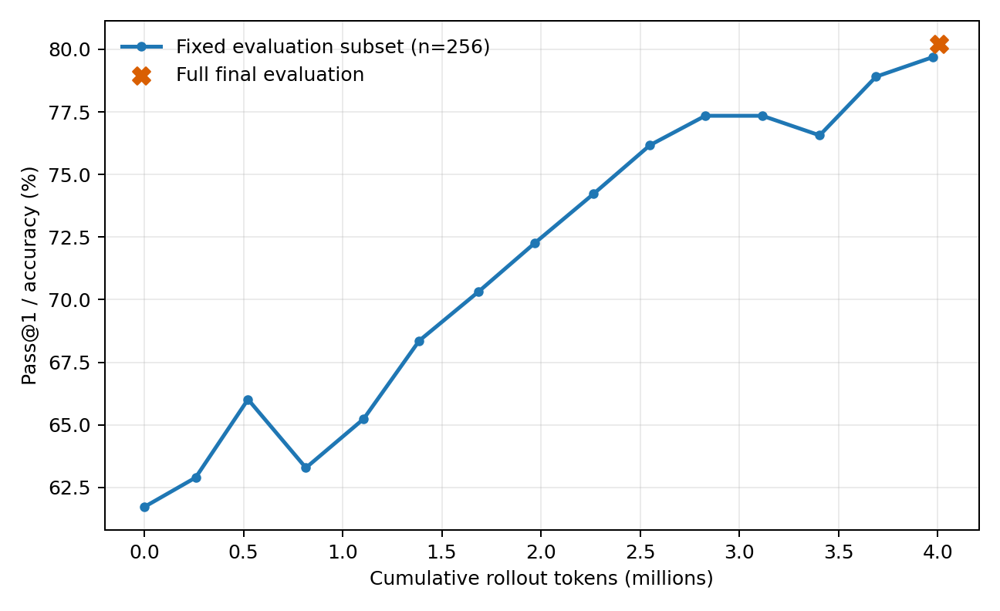
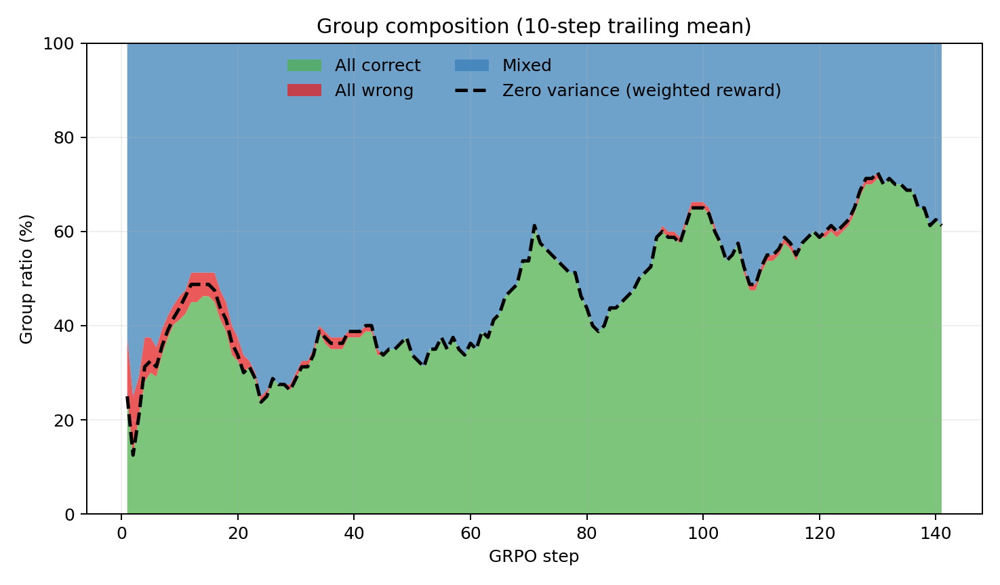
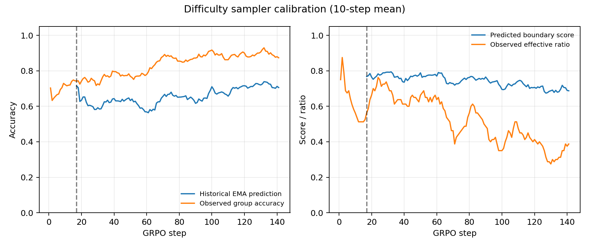

# GRPO with EMA Difficulty-Aware Sampling

Run: `difficulty_20260918_090256`  
Model: Qwen2.5-Math-1.5B (no project-specific SFT)  
Dataset: GSM8K  
Seed: 42  
Group size: 8  
Difficulty score: `4p(1-p)` with answer-accuracy EMA  
EMA beta: 0.9  
Uniform exploration: 0.1  
Warm-up: 128 unique prompt groups  
Budget: 4,000,000 rollout tokens

## Outcome

The run completed normally after 141 optimizer steps and 4,008,646 rollout
tokens. Training took 1,478 seconds on one NVIDIA A800 80GB PCIe.

On the fixed 256-example subset, Pass@1 rose from 61.72% to 79.69% at step
140. The final checkpoint scored 80.21% (1,058/1,319) on the full GSM8K test
set. The full-test endpoint and fixed-subset curve use different denominators.

## Sampling efficiency

| Quantity | Result |
|---|---:|
| Attempted/optimized groups | 1,128 |
| Zero-variance groups | 544 (48.23%) |
| Effective groups | 584 (51.77%) |
| Effective groups per 1M rollout tokens | 145.69 |
| Estimated zero-variance rollout tokens | 1,921,049 (47.92%) |
| Observed unique prompts | 231/7,473 (3.09%) |

Compared with Vanilla, zero-variance group ratio fell from 52.38% to 48.23%
and effective groups per million tokens rose from 143.90 to 145.69 (+1.24%).
The absolute number of effective groups increased only from 579 to 584.

The sampler generated longer responses on average (378.0 versus 354.5 tokens
for Vanilla), so the fixed token budget covered 1,128 groups instead of 1,216.
This offset much of the improvement in effective-group ratio.

| Window | Zero variance | Effective | All correct | All wrong | Mixed |
|---|---:|---:|---:|---:|---:|
| First 20 steps | 38.75% | 61.25% | 36.88% | 5.00% | 58.13% |
| Middle 20 steps | 48.75% | 51.25% | 48.75% | 0.00% | 51.25% |
| Last 20 steps | 65.63% | 34.38% | 65.63% | 0.00% | 34.38% |
| All steps | 48.23% | 51.77% | 47.70% | 1.15% | 51.15% |

## Difficulty-estimator calibration

After warm-up, 89.7% of selected prompts had prior history. On batches made
entirely of previously observed prompts:

- historical EMA predicted 66.03% answer accuracy on average;
- observed group accuracy was 85.48%;
- the mean calibration gap was +19.45 percentage points;
- predicted boundary score and observed effective ratio had Pearson r=0.525.

In the last 20 calibrated batches, predicted accuracy was 69.60%, while actual
accuracy was 89.61%. The beta=0.9 EMA therefore lagged behind the improving
policy and continued to rank prompts as boundary cases after many had become
easy. This explains why the last-20-step zero-variance ratio returned to
65.63%.

The sampler concentrated 1,128 selections on 231 prompts. Median selection
count was 1, the 90th percentile was 12, and the most-selected prompt appeared
19 times. At the end, 107 observed prompts had EMA accuracy exactly 1.0 and 12
had EMA accuracy exactly 0.0.

## Tokens to target accuracy

Targets use the fixed 256-example evaluation subset.

| Target | Cumulative rollout tokens | Versus Vanilla |
|---|---:|---:|
| 65% | 522,949 | 36.40% fewer |
| 70% | 1,684,362 | 5.21% more |
| 75% | 2,549,669 | 6.49% more |
| 79% | 3,975,672 | 0.07% more |

The final full evaluation contained 98 format failures (7.43%), 163 parsed
wrong answers (12.36%), and 1,058 correct answers (80.21%).

## Interpretation

H3 receives weak single-seed support: pre-rollout difficulty sampling produced
five more effective groups and 1.24% more effective groups per token than
Vanilla. The gain is too small to treat as robust. H4 is not supported overall:
the method improved early tokens-to-65%, but was slightly worse at later
targets and finished 1.59 accuracy points below Vanilla on the full test set.

The failure mode is informative and directly measured: a slow historical EMA
is stale under a rapidly improving policy. A targeted next ablation should
reduce EMA beta or incorporate recency/reward-variance updates rather than
adding Dynamic filtering immediately.
