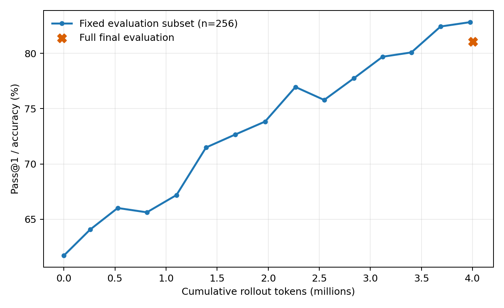
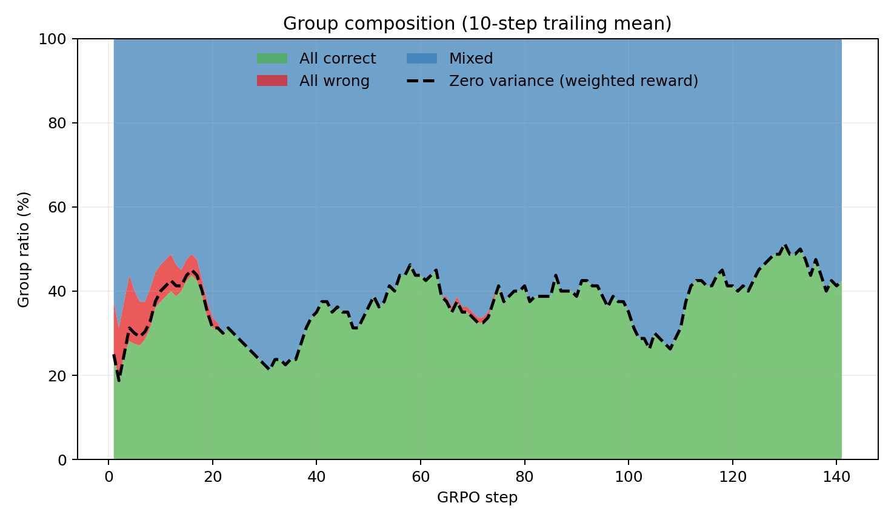
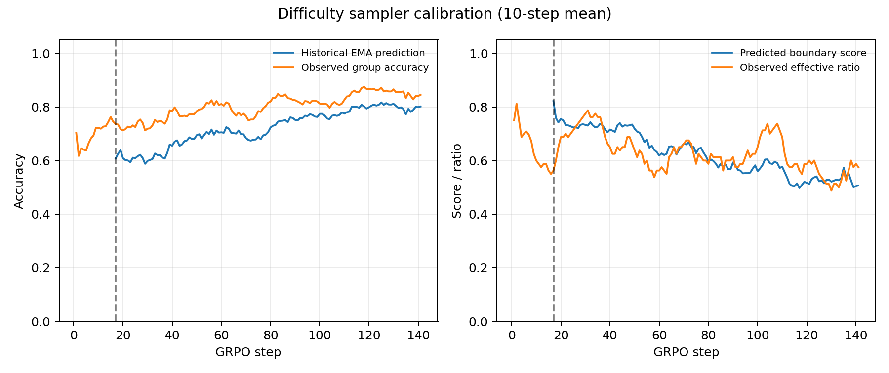

# GRPO with Fast-EMA Difficulty-Aware Sampling

Run: `difficulty_beta05_20260918_094940`  
Model: Qwen2.5-Math-1.5B (no project-specific SFT)  
Dataset: GSM8K  
Seed: 42  
Group size: 8  
Difficulty score: `4p(1-p)` with answer-accuracy EMA  
EMA beta: 0.5  
Uniform exploration: 0.1  
Warm-up: 128 unique prompt groups  
Budget: 4,000,000 rollout tokens

## Outcome

The run completed normally after 141 optimizer steps and 4,005,970 rollout
tokens. Training took 1,467 seconds on one NVIDIA A800 80GB PCIe.

On the fixed 256-example subset, Pass@1 rose from 61.72% to 82.81% at step
140. The final checkpoint scored 81.05% (1,069/1,319) on the full GSM8K test
set. The fixed-subset curve and full-test endpoint use different denominators.

## Sampling efficiency

| Quantity | Fast EMA | Beta=0.9 | Vanilla |
|---|---:|---:|---:|
| Attempted groups | 1,128 | 1,128 | 1,216 |
| Zero-variance group ratio | 37.41% | 48.23% | 52.38% |
| Effective groups | 706 | 584 | 579 |
| Effective groups / 1M tokens | 176.24 | 145.69 | 143.90 |
| Estimated zero-variance token ratio | 37.16% | 47.92% | 51.35% |

Fast EMA generated 122 more effective groups than beta=0.9 under essentially
the same token budget and response length. Relative to Vanilla, it improved
effective groups per million rollout tokens by 22.47%, without generating and
then discarding groups.

| Window | Zero variance | Effective | All correct | All wrong | Mixed |
|---|---:|---:|---:|---:|---:|
| First 20 steps | 35.63% | 64.38% | 34.38% | 5.63% | 60.00% |
| Middle 20 steps | 37.50% | 62.50% | 37.50% | 0.63% | 61.88% |
| Last 20 steps | 45.63% | 54.38% | 45.63% | 0.00% | 54.38% |
| All steps | 37.41% | 62.59% | 37.23% | 0.89% | 61.88% |

## Calibration test

Reducing beta directly addressed the failure diagnosed in the first sampler:

| Calibration metric | Beta=0.9 | Beta=0.5 |
|---|---:|---:|
| Post-warm-up predicted accuracy | 66.03% | 72.32% |
| Post-warm-up observed accuracy | 85.48% | 80.43% |
| Calibration gap | 19.45 pp | 8.12 pp |
| Last-20 calibration gap | 20.01 pp | 5.88 pp |

The overall calibration gap fell by 11.33 percentage points, or 58.26%.
Predicted boundary score retained a moderate correlation with observed
effective ratio (Pearson r=0.505). The last-20 zero-variance ratio was 45.63%,
versus 65.63% with beta=0.9.

## Tokens to target accuracy

Targets use the fixed 256-example evaluation subset.

| Target | Fast-EMA tokens | Versus Vanilla | Versus beta=0.9 |
|---|---:|---:|---:|
| 65% | 527,041 | 35.90% fewer | 0.78% more |
| 70% | 1,391,718 | 13.07% fewer | 17.37% fewer |
| 75% | 2,267,272 | 5.31% fewer | 11.08% fewer |
| 79% | 3,120,415 | 21.46% fewer | 21.51% fewer |

The final full evaluation contained 74 format failures (5.61%), 176 parsed
wrong answers (13.34%), and 1,069 correct answers (81.05%). This was 0.83
accuracy points above beta=0.9 and 0.76 points below Vanilla.

## Interpretation

The controlled beta ablation strongly supports the causal diagnosis that a
slow prompt-history EMA was making the sampler stale. Fast EMA materially
improved calibration and generated-effective-group efficiency. It also
improved the fixed-subset learning curve and tokens-to-target metrics.

The endpoint evidence is still mixed: the fixed subset favored Fast EMA by
3.52 points at the budget, while the larger full test favored Vanilla by 0.76
points. Because every result currently uses seed 42, the next experiment
should replicate Vanilla and Fast EMA on additional seeds before adding a
second mechanism such as Dynamic filtering.
