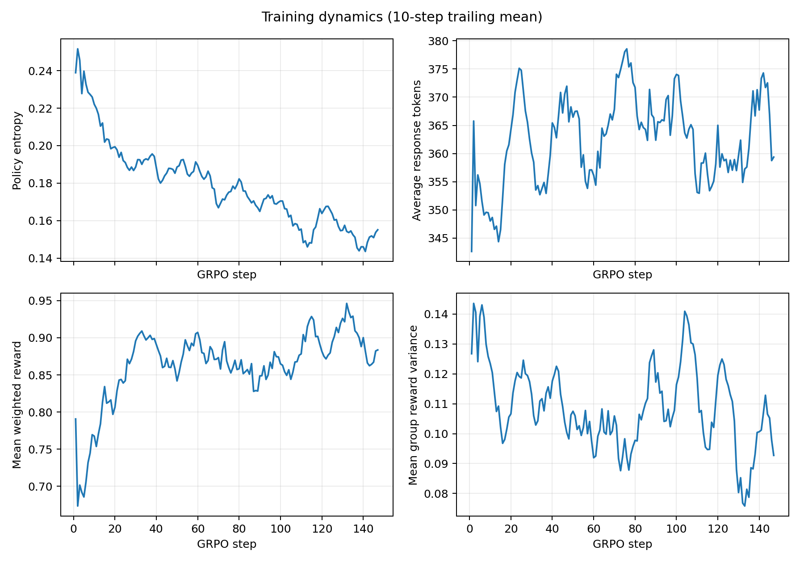
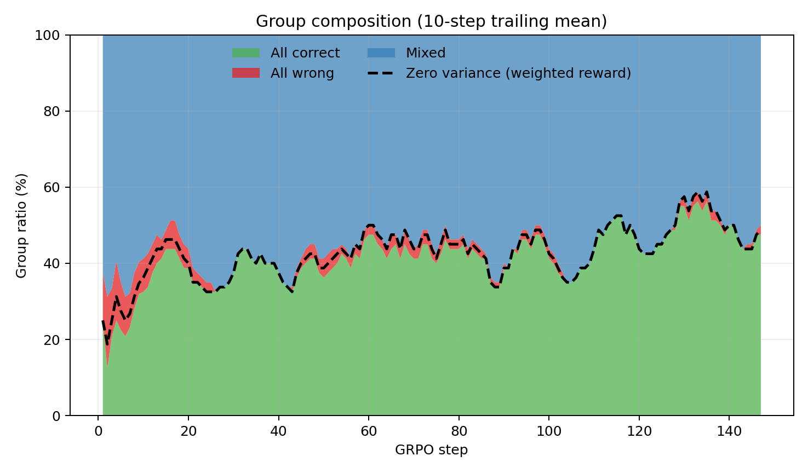
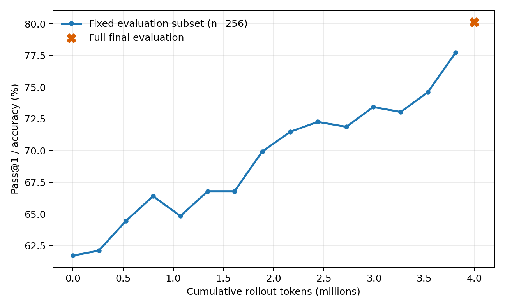

# Coverage-Aware Difficulty Sampling (seed 42)

This run tests whether adding an explicit under-sampling bonus can reduce the
data-concentration failure mode observed with Fast-EMA Difficulty Sampling.
It uses the same Qwen2.5-Math-1.5B model, raw GSM8K data, reward, GRPO loss,
generation settings, seed, and approximately four-million-token rollout
budget as the seed-42 baselines. The only sampler change is a coverage weight
of 0.3, combined with beta=0.5 boundary tracking and 10% uniform exploration.

## Main result

| Metric | Vanilla | Fast EMA | Coverage-aware |
|---|---:|---:|---:|
| Rollout tokens | 4,023,667 | 4,005,970 | 4,001,083 |
| Zero-variance groups | 52.38% | **37.41%** | 43.54% |
| Last-20 zero variance | 65.00% | **45.63%** | 51.25% |
| Effective groups | 579 | **706** | 664 |
| Effective groups / 1M tokens | 143.90 | **176.24** | 165.96 |
| Observed training prompts | Not tracked | 238 | **507** |
| Dataset prompt coverage | Not tracked | 3.18% | **6.78%** |
| Mean selections / observed prompt | Not tracked | 4.74 | **2.32** |
| Maximum selections of one prompt | Not tracked | 23 | **11** |
| Average response length | 354.50 | 378.88 | 362.62 |
| Full GSM8K Pass@1 | **81.80%** | 81.05% | 80.14% |

The coverage term behaved as intended. It more than doubled observed prompt
coverage relative to Fast EMA (2.13x), halved the maximum repeat count, and
shortened responses by 16.3 tokens on average. Coverage-aware sampling still
generated 15.33% more effective groups per million tokens than Vanilla, with
no post-generation discard cost.

It did not improve accuracy. It generated 5.83% fewer effective groups per
token than Fast EMA, reached later fixed-subset targets more slowly, and its
full-test accuracy was 0.91 points below Fast EMA and 1.67 points below
Vanilla. Therefore a fixed 0.3 coverage mixture is not the missing solution to
the generalization gap.

## What the negative result identifies

After warm-up, only 63.84% of selected prompts had a previous EMA estimate;
the other 36.16% were exploration selections. This substantially increased
diversity, but also spent too much of the fixed budget away from prompts known
to lie near the current decision boundary. Zero variance consequently rose
from 38.13% in the first 20 steps to 51.25% in the last 20 steps.

The result exposes a three-way tradeoff rather than a one-dimensional sampler
ranking:

- Vanilla has high coverage but wastes late rollouts on mastered prompts.
- Fast EMA maximizes effective signal but repeatedly trains on a small prompt
  pool.
- Fixed coverage mixing moves between them: it preserves most of the signal
  gain and doubles measured coverage, but does not recover final accuracy.

This supports the diagnosis that effective-group ratio is necessary but not
sufficient. Prompt diversity and where exploration is placed in training
also matter.

## Error composition

| Full-test outcome | Vanilla | Fast EMA | Coverage-aware |
|---|---:|---:|---:|
| Correct | **1,079** | 1,069 | 1,057 |
| Wrong answer | 156 | 176 | **155** |
| Wrong format | 84 | **74** | 107 |

Coverage-aware sampling reduced wrong-answer cases by 21 relative to Fast
EMA, but added 33 wrong-format cases, for a net loss of 12 correct examples.
This suggests that broader exploration exposed less stable output formatting.
That interpretation is plausible but not yet causal: one seed cannot separate
a sampler effect from evaluation noise, and the format reward is only 0.1.

## Tokens to target accuracy

Targets use the common fixed 256-example evaluation subset.

| Target | Vanilla | Fast EMA | Coverage-aware |
|---|---:|---:|---:|
| 65% | 0.822M | **0.527M** | 0.799M |
| 70% | 1.601M | **1.392M** | 2.166M |
| 75% | 2.394M | **2.267M** | 3.814M |
| 79% | 3.973M | **3.120M** | Not reached |

## Diagnostic correction

This legacy run logged mean EMA accuracy over previously seen prompts but
mean observed accuracy over both seen and unseen prompts. Those values are not
calibrated on the same population. Only one post-warm-up batch contained all
seen prompts, so the analyzer now reports the calibration fields as `null`
instead of deriving a misleading gap or correlation. New runs log
`selected_seen_group_accuracy_mean` and
`selected_seen_effective_group_ratio`, allowing valid seen-prompt comparisons
without changing training behavior.

## Conclusion and next controlled experiment

The fixed coverage bonus solved the measured concentration problem but not
the downstream generalization problem. The next minimal test should change
the *schedule*, not introduce another reward or loss change: front-load
coverage with a larger unique-prompt warm-up, then switch to pure Fast-EMA
boundary sampling. This tests whether the sampler can build a broader prompt
pool early without continuously paying the 36% unseen-selection cost late in
training.
