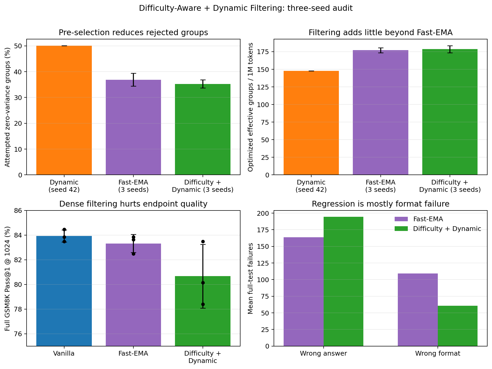
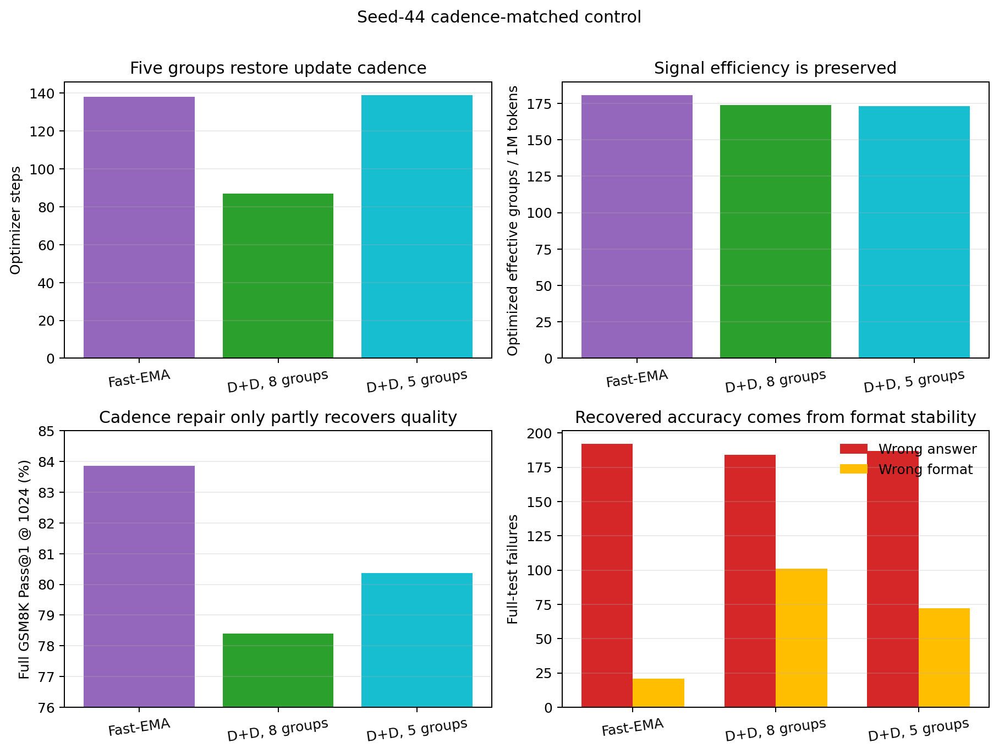

# Difficulty-Aware + Dynamic Filtering audit

All runs use Qwen2.5-Math-1.5B, GSM8K, group size 8, and an approximately
four-million rollout-token budget. Difficulty-Dynamic results use paired seeds
42, 43, and 44. The standalone Dynamic baseline is available only for seed 42,
so comparisons against it are descriptive rather than paired multi-seed claims.

## Result

| Metric | Dynamic, seed 42 | Fast-EMA, 3 seeds | Difficulty + Dynamic, 3 seeds |
|---|---:|---:|---:|
| Attempted zero-variance groups | 50.08% | 36.88% +/- 2.51% | **35.26% +/- 1.57%** |
| Discarded rollout-token ratio | 44.36% | n/a | **31.59% +/- 2.10%** |
| Optimized effective groups / 1M tokens | 147.65 | 176.99 +/- 3.42 | **178.51 +/- 5.03** |
| Optimizer steps | 74 | 140.67 +/- 2.52 | 89.33 +/- 2.52 |
| Full GSM8K Pass@1 @ 1024 | not re-evaluated | 83.32% +/- 0.73% | 80.67% +/- 2.58% |

Difficulty-aware pre-selection consistently lowers the waste seen by
post-generation Dynamic Filtering. Relative to the seed-42 Dynamic baseline,
the mean discarded-token ratio falls from 44.36% to 31.59%, while optimized
effective groups per million tokens rise from 147.65 to 178.51. However,
Difficulty-Dynamic is only 0.86% above Fast-EMA on effective groups per token:
the filtering stage mostly repacks approximately the same amount of useful
signal rather than creating more of it.

## Why endpoint accuracy regressed

Difficulty-Dynamic performs 89.3 optimizer
updates on average, versus 140.7 for
Fast-EMA. Every Difficulty-Dynamic update contains eight effective groups,
whereas Fast-EMA retains zero-advantage groups in the nominal batch. With the
same learning rate and token-mean loss, mean gradient norm rises from
0.269 to
0.327 (21.4%).
This is evidence that filtering changed optimization intensity, not just
rollout accounting.

The paired full-test difference versus Fast-EMA is
-2.65 percentage points, with a wide three-seed 95% t
interval of [-9.28, 3.97].
The failure decomposition is more diagnostic than the aggregate score:
Fast-EMA averages 28.3 format
failures and 191.7 wrong answers;
Difficulty-Dynamic averages 60.7
and 194.3, respectively. Of the
35-example mean correctness gap, 32.3 examples come from format failures and
only 2.7 from explicit wrong answers. The regression is therefore primarily a
format-stability failure, not evidence of a comparable collapse in mathematical
answer quality.

## Cadence-matched control

The seed-44 follow-up changes only the target accepted batch from eight prompt
groups (64 responses) to five groups (40 responses). This restores optimizer
steps from 87 to
139, matching Fast-EMA's
138 steps, while preserving rollout efficiency.

| Seed-44 metric | Fast-EMA | D+D, 8 groups | D+D, 5 groups |
|---|---:|---:|---:|
| Optimizer steps | 138 | 87 | **139** |
| Effective groups / 1M tokens | 180.72 | 173.97 | 173.12 |
| Training format reward | 0.902 | 0.881 | **0.908** |
| Full Pass@1 @ 1024 | 83.85% | 78.39% | **80.36%** |
| Wrong answer | 192 | 184 | 187 |
| Wrong format | 21 | 101 | **72** |

Matching update cadence recovers 1.97
Pass@1 points and removes 29
format failures relative to naive Difficulty-Dynamic. It still trails Fast-EMA
by 3.49 points and has
51 additional format
failures. It passes the efficiency threshold but fails the pre-registered
accuracy and format guardrails. Update cadence is therefore a partial cause,
not a complete explanation; conditioning every optimizer batch on observed
non-zero reward variance remains associated with format instability. Per the
registered rule, this branch stops without a seed-43 replication.

## Conclusion

Pre-generation Fast-EMA sampling remains the recommended method. It provides
nearly all of Difficulty-Dynamic's token-level signal efficiency without the
format instability introduced by packing every optimizer batch with effective
groups. This rejects the naive hypothesis that maximizing the effective-group
fraction of each optimizer batch must improve final accuracy.

The cadence-matched control only partially repairs the regression and fails
its pre-registered screen. No further combined-filtering replication is
warranted. Fast-EMA is the final recommended sampler.
