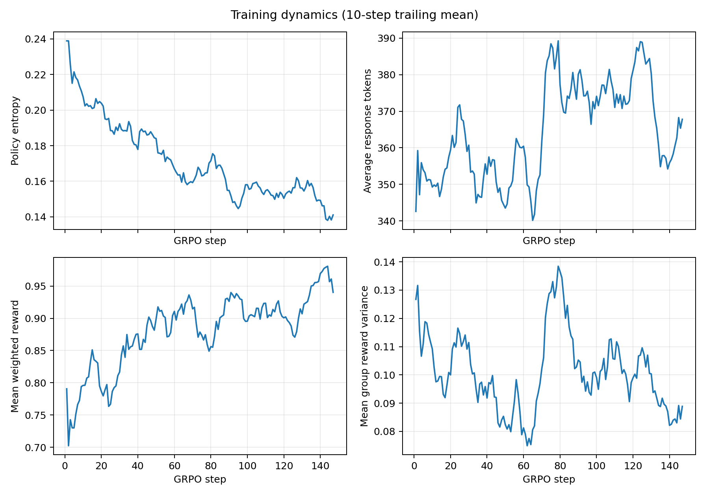
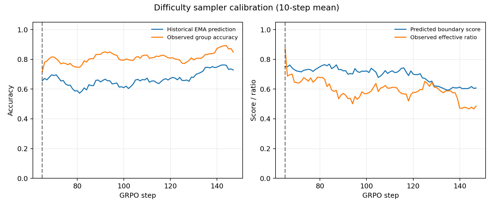
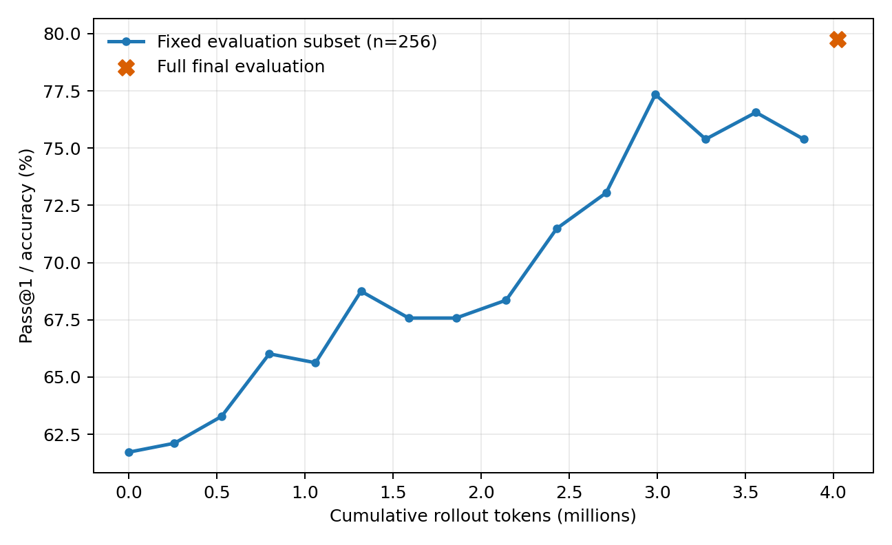

# Front-Loaded Coverage Curriculum (seed 42)

This run tests whether prompt diversity should be acquired early rather than
mixed into every training step. It samples 512 unique prompt groups during
warm-up, then switches to the beta=0.5 boundary sampler with coverage weight
zero and 10% uniform exploration. Model, reward, loss, generation, seed, and
the approximately four-million-token budget match the other seed-42 runs.

## Main result

| Metric | Vanilla | Fast EMA | Fixed coverage=0.3 | Front-loaded 512 |
|---|---:|---:|---:|---:|
| Rollout tokens | 4.024M | 4.006M | 4.001M | 4.025M |
| Zero-variance groups | 52.38% | **37.41%** | 43.54% | 45.49% |
| Last-20 zero variance | 65.00% | **45.63%** | 51.25% | 50.63% |
| Effective groups | 579 | **706** | 664 | 641 |
| Effective groups / 1M tokens | 143.90 | **176.24** | 165.96 | 159.26 |
| Observed prompts | Not tracked | 238 | 507 | **580** |
| Dataset prompt coverage | Not tracked | 3.18% | 6.78% | **7.76%** |
| Maximum selections / prompt | Not tracked | 23 | 11 | **8** |
| Full GSM8K Pass@1 | **81.80%** | 81.05% | 80.14% | 79.76% |

The schedule succeeded mechanically but missed all joint success criteria.
It produced the widest measured prompt pool and the least prompt repetition,
yet generated 9.63% fewer effective groups per token than Fast EMA and 4.04%
fewer than fixed coverage. Its full-test accuracy was 1.29 points below Fast
EMA and 2.05 points below Vanilla. The early-coverage/late-focus hypothesis is
therefore not supported by this seed.

## Phase decomposition

Warm-up ended after 64 optimizer steps, consuming 1.688M tokens, or 41.9% of
the total budget.

| Phase | Groups | Tokens | Zero variance | Effective groups / 1M tokens | Avg. response length |
|---|---:|---:|---:|---:|---:|
| Unique-prompt warm-up | 512 | 1.688M | 46.88% | **161.18** | 352.82 |
| Post-warm-up boundary sampling | 664 | 2.337M | **44.43%** | 157.87 | 374.05 |

Boundary sampling reduced zero variance by only 2.45 percentage points after
the transition. Its responses were 21.23 tokens longer on average, so the
effective-groups-per-token rate decreased despite the slightly better group
composition. Spending nearly half the budget constructing the pool also left
only 83 steps for focused sampling.

## The wider pool recreated stale difficulty estimates

This run contains the corrected seen-prompt diagnostics. Across all 83
post-warm-up batches:

- mean predicted EMA accuracy was 66.75%;
- mean observed accuracy on the same seen prompts was 81.27%;
- the calibration lag was therefore 14.52 percentage points;
- the boundary score still correlated with seen-prompt effectiveness
  (`r=0.473`), so the ranking retained some information but was poorly
  calibrated in absolute terms.

The likely mechanism is revisit delay. A 512-prompt pool means each prompt is
updated much less frequently. The policy improves globally between visits,
so even beta=0.5 histories systematically underestimate current success. The
sampler then treats already-easier prompts as boundary cases, leading back to
all-correct groups. This is an inference supported by the measured lag and
phase behavior, not yet a separately randomized causal test.

The previous Fast-EMA calibration gap was 8.12 points, although that legacy
run only allowed calibration on fully-seen batches. The exact gaps are not
perfectly comparable; the direction nevertheless agrees with the revisit-lag
diagnosis.

## Accuracy and error composition

| Full-test outcome | Vanilla | Fast EMA | Fixed coverage | Front-loaded |
|---|---:|---:|---:|---:|
| Correct | **1,079** | 1,069 | 1,057 | 1,052 |
| Wrong answer | 156 | 176 | **155** | 162 |
| Wrong format | 84 | **74** | 107 | 105 |

The two coverage-oriented runs both ended near 8% format failure, higher than
Vanilla and Fast EMA. This repeated pattern is worth monitoring, but two
seed-42 sampler variants are still insufficient to claim that coverage causes
format degradation.

Tokens to fixed-subset targets were 0.798M (65%), 2.428M (70%), and 2.989M
(75%); 79% was not reached. Fast EMA reached the same targets in 0.527M,
1.392M, 2.267M, and 3.120M tokens respectively.

## Decision

Do not replicate this configuration across seeds: it is dominated by Fast EMA
on both rollout efficiency and full-test accuracy in the seed-42 screening
run. The experiment has still falsified a useful explanation. Merely enlarging
the history pool, whether continuously or up front, does not recover
generalization and can make per-prompt histories stale again.

The next sampler change, if pursued, should target temporal calibration rather
than add more coverage. One minimal option is a global policy-drift correction
that shifts stale prompt probabilities using the recent seen-prompt
prediction error before applying `4p(1-p)`. That would require a new controlled
ablation; it is not supported as a result of this run.

