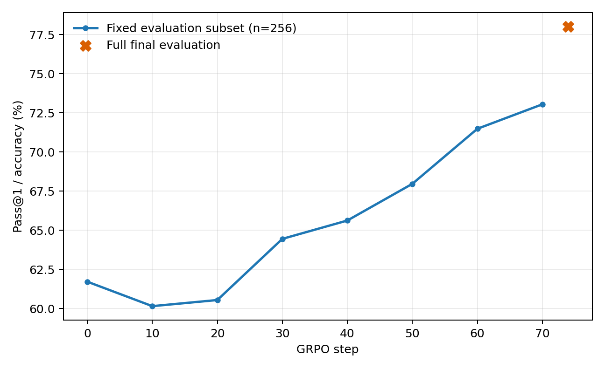
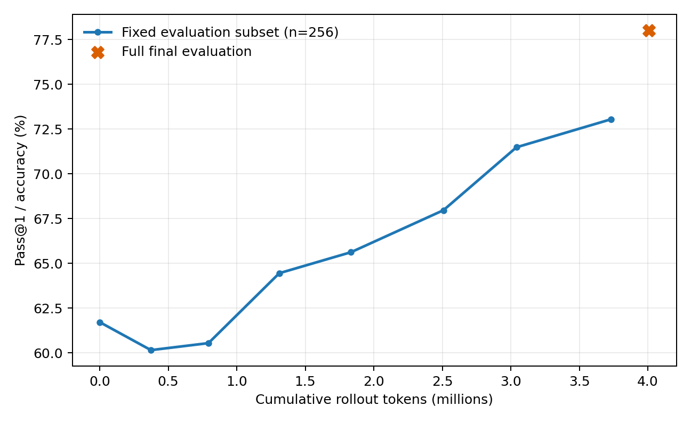
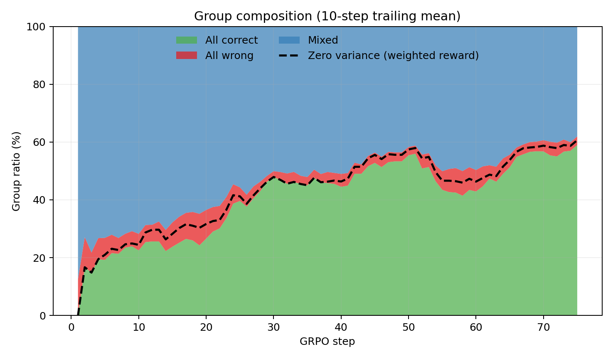
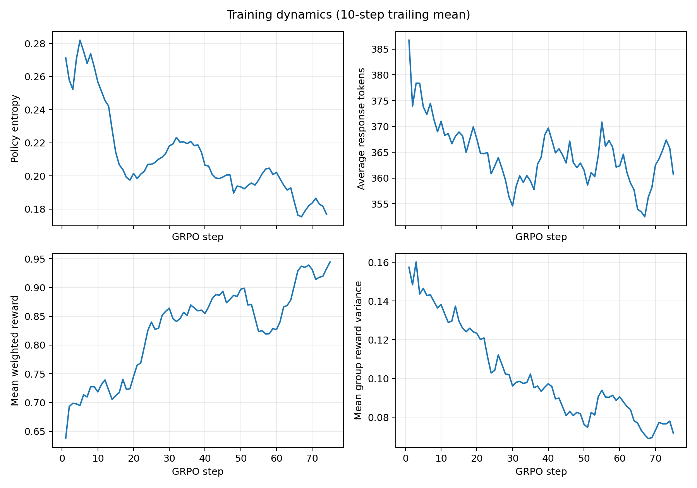

# GRPO with post-rollout Dynamic Sampling

Run: `dynamic_20260917_230635`  
Model: Qwen2.5-Math-1.5B (no project-specific SFT)  
Dataset: GSM8K  
Seed: 42  
Group size: 8  
Loss: `reinforce_with_baseline`  
Budget: 4,000,000 rollout tokens

## Outcome

The run completed normally at 4,009,358 rollout tokens. It performed 74
optimizer steps; a final partial collection consumed the remaining budget but
did not update the model because it contained only 3 of the required 8
effective groups. Training took 1,442 seconds on one NVIDIA A800 80GB PCIe.

On the fixed 256-example evaluation subset, Pass@1 rose from 61.72% to 73.05%
at the last intermediate evaluation (step 70, 3,730,529 rollout tokens). The
final checkpoint scored 78.01% (1,029/1,319) on the full GSM8K test set.

## Dynamic filtering cost

| Quantity | Result |
|---|---:|
| Attempted groups | 1,192 |
| Generated effective groups | 595 (49.92%) |
| Discarded zero-variance groups | 597 (50.08%) |
| Effective groups used for optimization | 592 |
| Effective ratio inside completed optimizer batches | 100.00% |
| Exact discarded rollout tokens | 1,778,411 (44.36%) |

The group discard ratio is higher than the discarded token ratio because
zero-variance groups, especially all-correct groups, tend to produce shorter
responses. Dynamic Sampling successfully packed every completed optimizer
batch with effective groups, but it could not recover the generation cost
already spent on discarded groups.

| Window | Zero variance | Effective | All correct | All wrong | Mixed |
|---|---:|---:|---:|---:|---:|
| First 20 steps | 30.74% | 69.26% | 26.84% | 7.79% | 65.37% |
| Middle 20 steps | 53.76% | 46.24% | 52.31% | 3.18% | 44.51% |
| Last 20 steps | 58.99% | 41.01% | 56.88% | 3.70% | 39.42% |
| All generated groups | 50.08% | 49.92% | 47.82% | 4.53% | 47.65% |

The step/zero-variance Pearson correlation was 0.631. As in Vanilla, the
increase was driven mainly by all-correct groups rather than all-wrong groups.

## Tokens to target accuracy

Targets use the fixed 256-example evaluation subset.

| Target | First step | Cumulative rollout tokens | Observed accuracy |
|---|---:|---:|---:|
| 65% | 40 | 1,833,800 | 65.62% |
| 70% | 60 | 3,041,139 | 71.48% |
| 75% | Not reached | - | - |
| 79% | Not reached | - | - |

The final full evaluation contained 128 format failures (9.70%), 162 parsed
but wrong answers (12.28%), and 1,029 correct answers (78.01%).

## Interpretation and limits

This run supports the mechanical claim behind Dynamic Sampling: it raises the
effective ratio of data entering the optimizer to 100%. It also directly
measures its limitation: 44.36% of the rollout-token budget was still spent
on groups discarded only after generation. The result is from one seed and
does not establish a general performance ranking.
