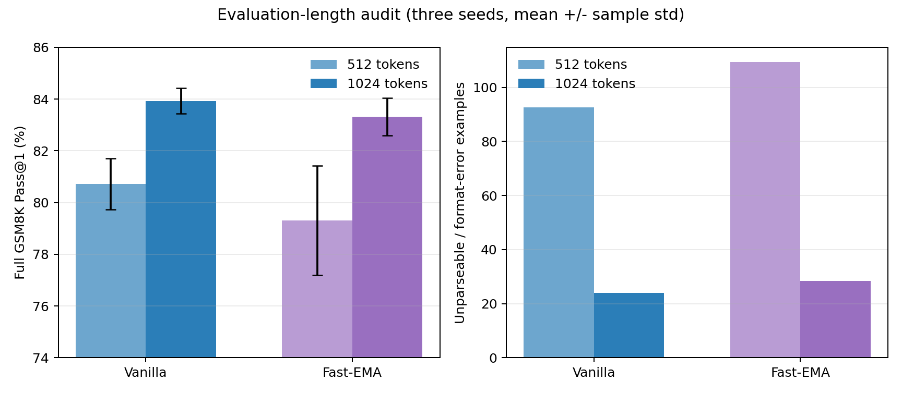
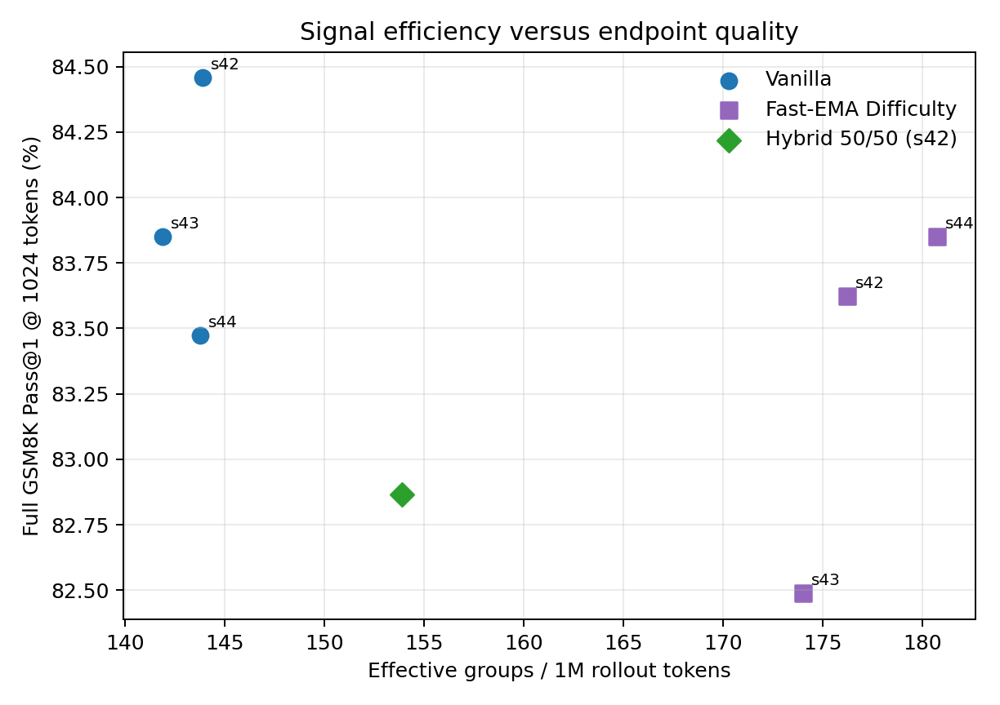

# Evaluation-Length Audit and Final Multi-Seed Result

All endpoint comparisons use the complete 1,319-example GSM8K test split with greedy decoding. Training used the same approximately four-million rollout-token budget in every run.

## Corrected endpoint result

| Seed | Vanilla @512 | Fast-EMA @512 | Vanilla @1024 | Fast-EMA @1024 | 1024 paired diff |
|---:|---:|---:|---:|---:|---:|
| 42 | 81.80% | 81.05% | 84.46% | 83.62% | -0.83 pp |
| 43 | 79.91% | 76.95% | 83.85% | 82.49% | -1.36 pp |
| 44 | 80.44% | 79.91% | 83.47% | 83.85% | +0.38 pp |
| **Mean** | **80.72%** | **79.30%** | **83.93%** | **83.32%** | **-0.61 pp** |

At 1024 tokens, Vanilla averaged 83.93% +/- 0.50 and Fast-EMA averaged 83.32% +/- 0.73. The paired Fast-EMA minus Vanilla difference was -0.61 +/- 0.89 points, with a 95% t interval of [-2.83, 1.61]. With three seeds, this interval is too wide to establish equivalence or superiority.

## Truncation was a real evaluation confound

Raising the evaluation limit from 512 to 1024 tokens improved Vanilla by 3.21 points on average and Fast-EMA by 4.02 points. Mean format/unparseable failures fell from 92.7 to 24.0 for Vanilla and from 109.3 to 28.3 for Fast-EMA. The original 512-token protocol therefore mislabeled many length-limited chains as formatting failures and disproportionately understated the active sampler's endpoint quality. Because the older runs did not log finish reasons, the before/after recovery is strong evidence of truncation rather than a direct per-response count.

## Signal efficiency remains the robust positive result

Across the same paired seeds, Fast-EMA increased effective groups per million rollout tokens from 143.19 to 176.99, a 23.60% +/- 1.81% relative gain. Zero-variance groups fell from 52.68% to 36.88%.

## Hybrid ablation

The 50/50 uniform-plus-difficulty sampler raised prompt coverage to 9.06% but achieved only 153.92 effective groups per million tokens and 82.87% Pass@1. It was dominated by seed-42 Fast-EMA on both efficiency and endpoint accuracy, so it was correctly stopped after screening rather than replicated.

## Defensible conclusion

Fast-EMA Difficulty-Aware Sampling reliably generates more non-zero GRPO advantages under a fixed rollout-token budget. After correcting the evaluation-length confound, its mean endpoint gap is 0.61 percentage points, not the original 1.42 points. The evidence supports a strong signal-efficiency claim and near-parity as a descriptive result, but not statistical non-inferiority or improved final accuracy.

Limitations: one model and dataset, three paired seeds, group size fixed at eight, and only final checkpoints were re-evaluated at 1024 tokens. Existing intermediate tokens-to-target curves still use the 512-token protocol.
