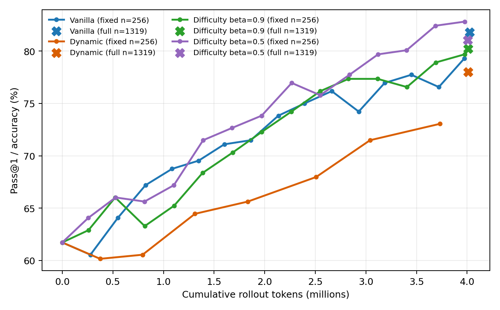
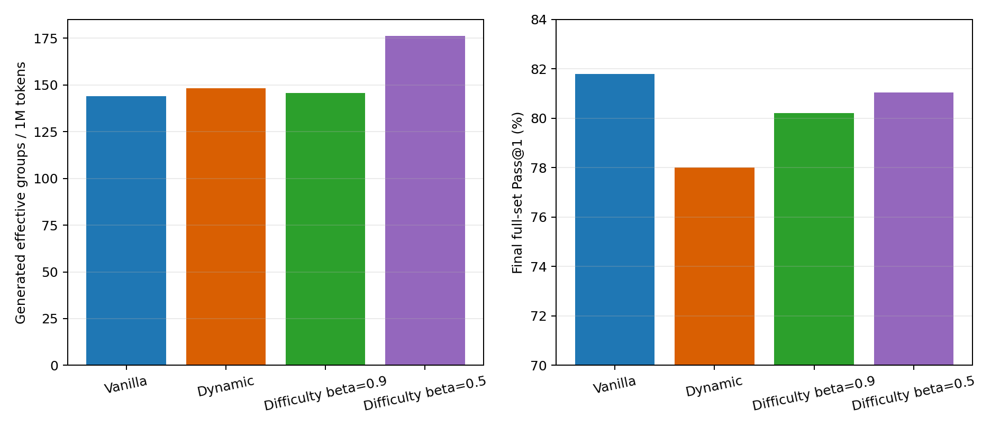

# Fixed-budget GRPO sampling comparison with Fast EMA

All runs use Qwen2.5-Math-1.5B, raw GSM8K, seed 42, group size 8, the same
reward/loss/generation settings, and approximately four million rollout
tokens. The beta=0.5 run changes only the prompt-accuracy EMA coefficient from
the original Difficulty-Aware configuration.

## Main comparison

| Metric | Vanilla | Dynamic | Difficulty beta=0.9 | Difficulty beta=0.5 |
|---|---:|---:|---:|---:|
| Rollout tokens | 4,023,667 | 4,009,358 | 4,008,646 | 4,005,970 |
| Optimizer steps | 152 | 74 | 141 | 141 |
| Attempted groups | 1,216 | 1,192 | 1,128 | 1,128 |
| Zero-variance group ratio | 52.38% | 50.08% | 48.23% | **37.41%** |
| Effective groups used | 579 | 592 | 584 | **706** |
| Effective groups / 1M tokens | 143.90 | 147.65 | 145.69 | **176.24** |
| Full GSM8K Pass@1 | **81.80%** | 78.01% | 80.21% | 81.05% |
| Training time | 1,520 s | 1,442 s | 1,478 s | 1,467 s |

Fast EMA improved generated effective groups per million tokens by 22.47%
over Vanilla and 19.36% over Dynamic. Unlike Dynamic, it incurred no
post-generation discard cost.

## Tokens to target accuracy

| Target | Vanilla | Dynamic | Beta=0.9 | Beta=0.5 |
|---|---:|---:|---:|---:|
| 65% | 822,210 | 1,833,800 | 522,949 | 527,041 |
| 70% | 1,600,923 | 3,041,139 | 1,684,362 | **1,391,718** |
| 75% | 2,394,308 | Not reached | 2,549,669 | **2,267,272** |
| 79% | 3,972,957 | Not reached | 3,975,672 | **3,120,415** |

Fast EMA used 21.46% fewer rollout tokens than Vanilla to first reach 79% on
the fixed evaluation subset. At the fixed-budget endpoint, it scored 82.81%
on that subset versus Vanilla's 79.30%. On the larger final evaluation,
however, Vanilla remained 0.76 points higher (81.80% versus 81.05%).

## Updated hypothesis assessment

- **H1 supported descriptively:** Vanilla zero variance increased from 28.12%
  in the first 20 steps to 65.00% in the last 20, driven by all-correct groups.
- **H2 supported:** Dynamic made completed optimizer batches fully effective,
  but spent 44.36% of rollout tokens on subsequently discarded groups.
- **H3 supported for the fast-EMA configuration:** pre-rollout sampling
  produced 22.47% more effective groups per token than Vanilla and avoided
  discard cost.
- **H4 partially supported:** Fast EMA materially improved the fixed-subset
  tokens-to-target curve, but did not exceed Vanilla on the final full test.

The beta ablation reduces the sampler calibration gap from 19.45 to 8.12
percentage points. This controlled result connects better history tracking to
lower zero variance and higher rollout efficiency. Additional seeds are
required before treating the accuracy difference as robust.
