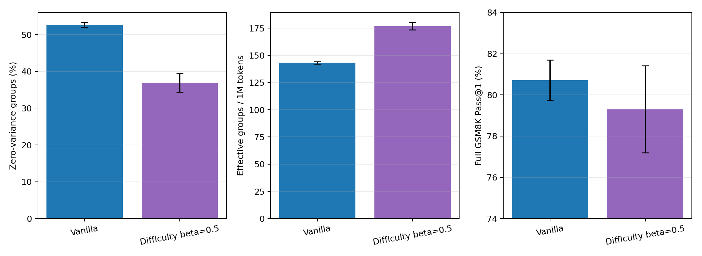
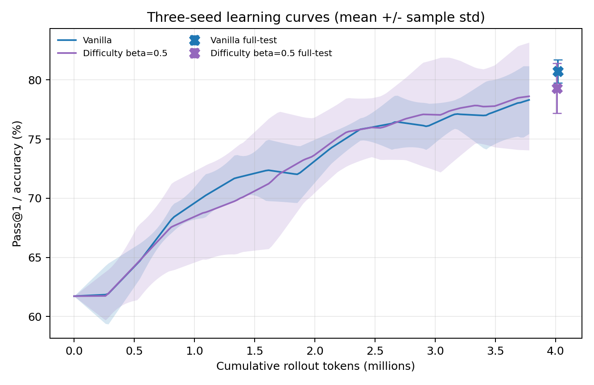

# Three-seed Vanilla versus Fast-EMA Difficulty Sampling

This report compares paired seeds 42, 43, and 44 under an approximately four
million rollout-token budget. All model, dataset, reward, loss, generation,
and evaluation settings are identical. Difficulty-Aware Sampling uses
`4p(1-p)`, EMA beta 0.5, 10% uniform exploration, and a 128-group warm-up.

## Main result

| Metric | Vanilla (mean +/- std) | Fast EMA (mean +/- std) | Paired mean change |
|---|---:|---:|---:|
| Rollout tokens | 4.018M +/- 0.005M | 4.011M +/- 0.010M | -0.007M |
| Zero-variance groups | 52.68% +/- 0.65% | **36.88% +/- 2.51%** | **-15.81 pp** |
| Last-20 zero variance | 67.92% +/- 2.60% | **42.92% +/- 5.24%** | **-25.00 pp** |
| Effective groups | 575.3 +/- 4.7 | **710.0 +/- 15.4** | **+134.7** |
| Effective groups / 1M tokens | 143.19 +/- 1.13 | **176.99 +/- 3.42** | **+33.80** |
| Average response length | 353.9 +/- 2.6 | 378.8 +/- 5.6 | +24.9 |
| Fixed-subset final accuracy | 78.91% +/- 2.56% | 78.65% +/- 4.77% | -0.26 pp |
| Full GSM8K Pass@1 | **80.72% +/- 0.98%** | 79.30% +/- 2.11% | **-1.42 pp** |

Fast EMA improved effective groups per million tokens in all three paired
runs: +22.47%, +22.65%, and +25.69%, for a mean relative improvement of
23.60% +/- 1.81%. It also reduced zero variance in every seed. This makes the
sampling-efficiency result substantially more robust than the original
single-seed observation.

## Learning efficiency and accuracy

The accuracy result does not follow the sampling-efficiency result. Full-test
Fast-EMA minus Vanilla differences were -0.76, -2.96, and -0.53 percentage
points for seeds 42, 43, and 44 respectively. Fast EMA was lower in every
paired seed, with a mean difference of -1.42 +/- 1.34 points.

The fixed 256-example learning curves are noisier: Fast EMA was +3.52 points
for seed 42, -2.73 for seed 43, and -1.56 for seed 44 at the final comparable
evaluation. Their three-seed mean endpoints are therefore effectively tied,
while the larger full test consistently favors Vanilla.

## Tokens to target accuracy

Targets use the fixed 256-example evaluation subset.

| Target | Vanilla reach rate | Vanilla tokens | Fast-EMA reach rate | Fast-EMA tokens |
|---|---:|---:|---:|---:|
| 65% | 3/3 | 0.730M +/- 0.158M | 3/3 | **0.621M +/- 0.156M** |
| 70% | 3/3 | **1.343M +/- 0.257M** | 3/3 | 1.465M +/- 0.692M |
| 75% | 3/3 | 2.126M +/- 0.453M | 2/3 | 1.985M +/- 0.399M* |
| 79% | 2/3 | 3.718M +/- 0.361M* | 2/3 | 3.008M +/- 0.159M* |

`*` Token means only include seeds that reached the target and must not be
read as an unconditional mean. Fast EMA reached 65% earlier in all three
seeds, but later targets were not consistently better. At 79%, both methods
reached the target in the same two seeds; Fast EMA was faster in those two.

## Why more effective groups did not improve final accuracy

Fast EMA observed only 3.18% +/- 0.19% of the 7,473 training prompts and
concentrated 1,104--1,144 group selections on 223--251 unique prompts. This is
an explicit measurement from sampler state, not an estimate. Its responses
were also 24.9 tokens longer on average, reducing the number of prompt groups
affordable under the fixed token budget.

The likely interpretation is a coverage-efficiency tradeoff: prioritizing
the current decision boundary produces more non-zero advantages, but repeated
optimization on a small prompt subset reduces data diversity and may hurt
generalization. This is an inference supported by the measured coverage and
accuracy pattern, not yet a separately controlled causal result.

Fast EMA's calibration gap was 8.01 +/- 0.97 percentage points, confirming
that beta 0.5 consistently tracked the moving policy better than the original
beta 0.9 run. The remaining limitation is therefore less about stale EMA and
more about exploration and coverage.

## Updated hypothesis assessment

- **H1 supported across seeds:** Vanilla averaged 52.68% zero-variance groups,
  rising to 67.92% in the final 20 steps.
- **H2 supported by the Dynamic baseline:** post-generation filtering spent
  44.36% of its rollout tokens on discarded groups in the seed-42 run.
- **H3 supported across seeds:** Fast EMA produced 23.60% more effective
  groups per token on average, with the improvement present in all seeds.
- **H4 not supported as a general claim:** early tokens-to-65% improved, but
  later targets were inconsistent and full-test accuracy was lower in all
  three paired seeds.

## Next controlled experiment

The evidence now motivates a coverage-aware ablation rather than Dynamic
filtering. The smallest change is to increase uniform exploration while
holding beta 0.5 fixed, or to add a recency/under-sampling bonus. The primary
success criterion should combine effective groups per token with prompt
coverage and full-test accuracy, rather than optimizing effective-group ratio
alone.
