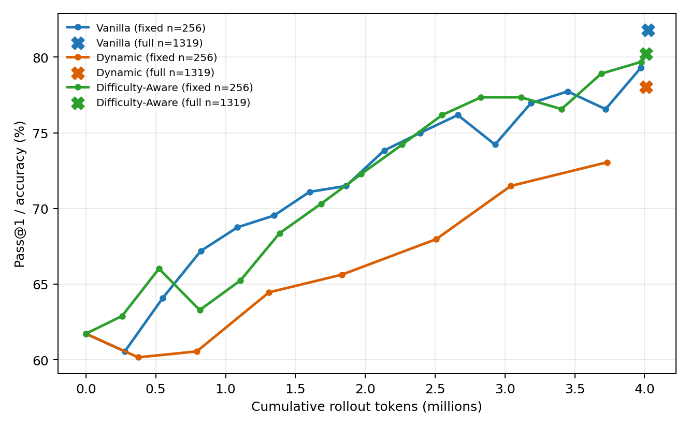
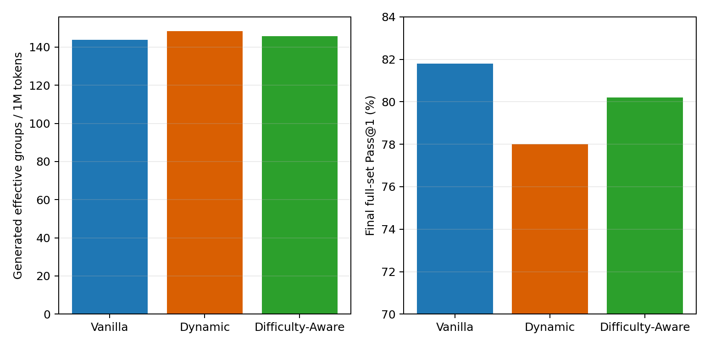

# Fixed-budget comparison of GRPO sampling strategies

All three runs use Qwen2.5-Math-1.5B, raw GSM8K, seed 42, group size 8,
identical reward/loss/generation settings, and approximately four million
rollout tokens.

## Main comparison

| Metric | Vanilla | Dynamic | Difficulty-Aware |
|---|---:|---:|---:|
| Rollout tokens | 4,023,667 | 4,009,358 | 4,008,646 |
| Optimizer steps | 152 | 74 | 141 |
| Attempted groups | 1,216 | 1,192 | 1,128 |
| Zero-variance group ratio | 52.38% | 50.08% | 48.23% |
| Effective groups used | 579 | 592 | 584 |
| Effective groups / 1M tokens | 143.90 | 147.65 | 145.69 |
| Full GSM8K Pass@1 | 81.80% | 78.01% | 80.21% |
| Training time | 1,520 s | 1,442 s | 1,478 s |

Dynamic attained the highest effective-group rate entering optimization, but
spent 1,778,411 tokens (44.36%) generating groups that were later discarded.
Difficulty-Aware avoided post-generation discard and modestly improved the
generated effective-group ratio, but longer responses reduced the total number
of groups affordable under the token budget.

## Tokens to target accuracy

| Target | Vanilla | Dynamic | Difficulty-Aware |
|---|---:|---:|---:|
| 65% | 822,210 | 1,833,800 | 522,949 |
| 70% | 1,600,923 | 3,041,139 | 1,684,362 |
| 75% | 2,394,308 | Not reached | 2,549,669 |
| 79% | 3,972,957 | Not reached | 3,975,672 |

Difficulty-Aware was substantially better at the early 65% checkpoint, then
lost that advantage. At nearly four million tokens, the fixed 256-example
subset slightly favored Difficulty-Aware (79.69% versus 79.30%), while the
larger full evaluation favored Vanilla (81.80% versus 80.21%). The full-set
result is the stronger endpoint, but all conclusions remain single-seed.

## Hypothesis assessment

- **H1 supported descriptively:** Vanilla zero variance increased from 28.12%
  in the first 20 steps to 65.00% in the last 20, driven by all-correct groups.
- **H2 supported:** Dynamic made completed optimizer batches 100% effective,
  yet 44.36% of its token budget was spent on discarded rollout groups.
- **H3 weakly supported:** Difficulty-Aware generated 584 effective groups
  versus Vanilla's 579 and improved effective groups per token by 1.24%.
- **H4 not supported overall:** Difficulty-Aware improved tokens-to-65%, but
  not the later targets or final full-set accuracy.

The calibration logs explain the modest result: after warm-up, actual selected
prompt accuracy exceeded the historical EMA estimate by 19.45 points. The
policy improved faster than beta=0.9 history could track, so prompts predicted
to lie near the boundary often generated all-correct groups. This motivates a
focused fast-EMA/recency ablation instead of claiming that the initial sampler
already solves ineffective rollouts.
