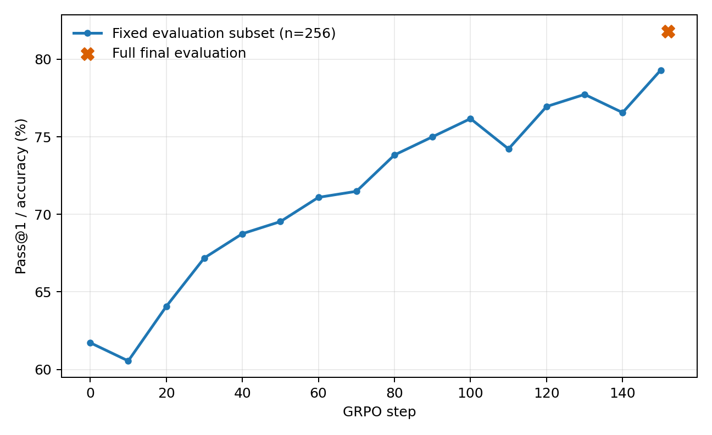
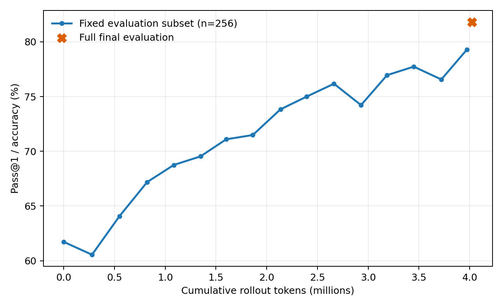
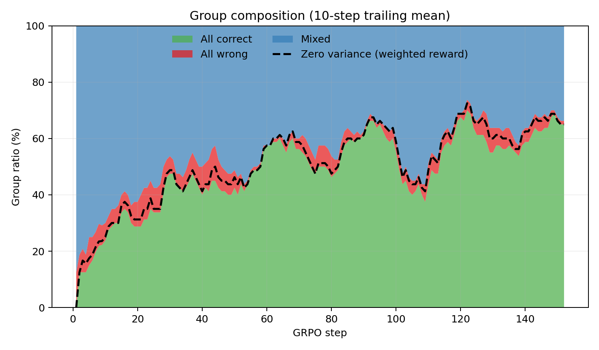
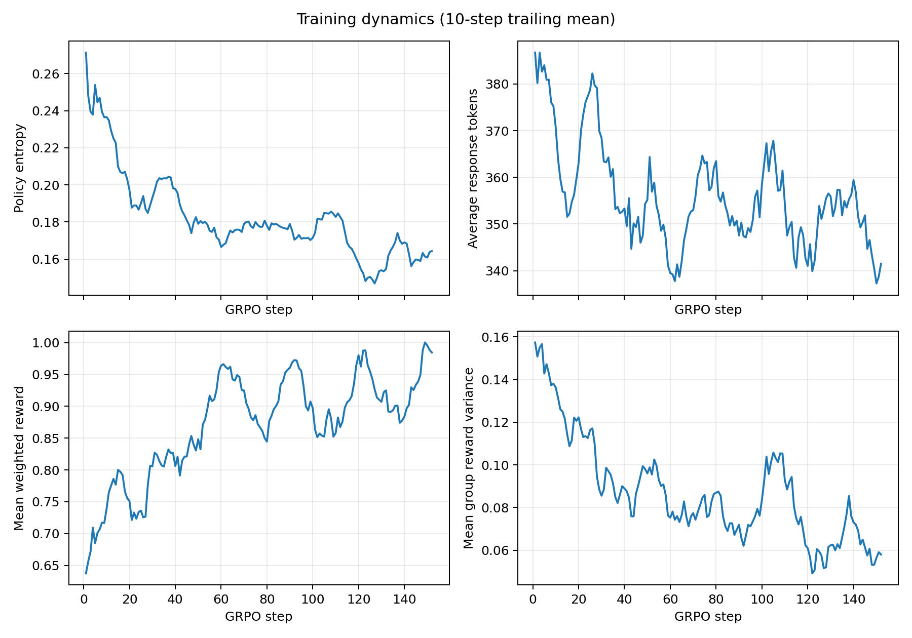

# Vanilla GRPO baseline — random sampling

Run: `vanilla_random_20260917_220541`  
Model: Qwen2.5-Math-1.5B (no project-specific SFT)  
Dataset: GSM8K  
Seed: 42  
Group size: 8  
Loss: `reinforce_with_baseline`  
Budget: 4,000,000 rollout tokens

## Outcome

The run completed normally after 152 GRPO steps and 4,023,667 rollout
tokens (3,448,571 generated response tokens). Training took 1,520 seconds on
one NVIDIA A800 80GB PCIe GPU.

On the fixed 256-example evaluation subset, Pass@1 rose from 61.72% at step 0
to 79.30% at step 150, a gain of 17.58 percentage points. The final checkpoint
scored 81.80% (1,079/1,319) on the full GSM8K test set. The full-test endpoint
is not directly comparable to the 256-example intermediate curve.

## Ineffective rollout diagnosis

| Window | Zero variance | Effective | All correct | All wrong | Mixed |
|---|---:|---:|---:|---:|---:|
| First 20 steps | 28.12% | 71.88% | 26.25% | 7.50% | 66.25% |
| Middle 20 steps | 55.62% | 44.38% | 55.00% | 5.00% | 40.00% |
| Last 20 steps | 65.00% | 35.00% | 63.12% | 3.12% | 33.75% |
| All 152 steps | 52.38% | 47.62% | 50.25% | 5.10% | 44.65% |

Across the run, 637 of 1,216 prompt groups had zero weighted-reward
variance. The step/zero-variance Pearson correlation was 0.467. The increase
was driven overwhelmingly by all-correct groups; all-wrong groups decreased.
This descriptively supports H1 for this run.

Weighting each batch's token count by its zero-variance group ratio estimates
that 2,065,966 tokens (51.35% of rollout cost) were spent on zero-variance
groups. This is an estimate because per-group token lengths were not logged.

## Tokens to target accuracy

Targets below use the fixed 256-example evaluation subset and report the first
observed checkpoint at or above the target.

| Target | First step | Cumulative rollout tokens | Observed accuracy |
|---|---:|---:|---:|
| 65% | 30 | 822,210 | 67.19% |
| 70% | 60 | 1,600,923 | 71.09% |
| 75% | 90 | 2,394,308 | 75.00% |
| 79% | 150 | 3,972,957 | 79.30% |

From step 0 to step 150, the run used approximately 226,017 rollout tokens
per percentage point of accuracy gained.

## Other dynamics

From the first 20 to the last 20 steps:

- policy entropy fell from 0.2169 to 0.1636;
- mean response length fell from 366.9 to 346.5 tokens;
- mean group reward variance fell from 0.1293 to 0.0636;
- advantage standard deviation fell from 0.7899 to 0.5205;
- format compliance rose from 85.55% to 92.50%.

The full final evaluation contained 84 format failures (6.37%), 156 parsed
but wrong answers (11.83%), and 1,079 correct answers (81.80%).

## Interpretation and limits

This single-seed baseline establishes the phenomenon needed for the project:
as accuracy increased, random sampling increasingly selected prompts whose
eight responses were all correct, reducing effective relative-advantage
signal. It does not yet establish that Dynamic Sampling or Difficulty-Aware
Sampling improves token efficiency.

The next controlled comparison should keep this model, seed, group size,
temperature, optimization configuration, and 4M-token budget fixed. Reported
ratios should use windowed statistics because each step contains only eight
prompt groups and therefore has 12.5-point resolution.
