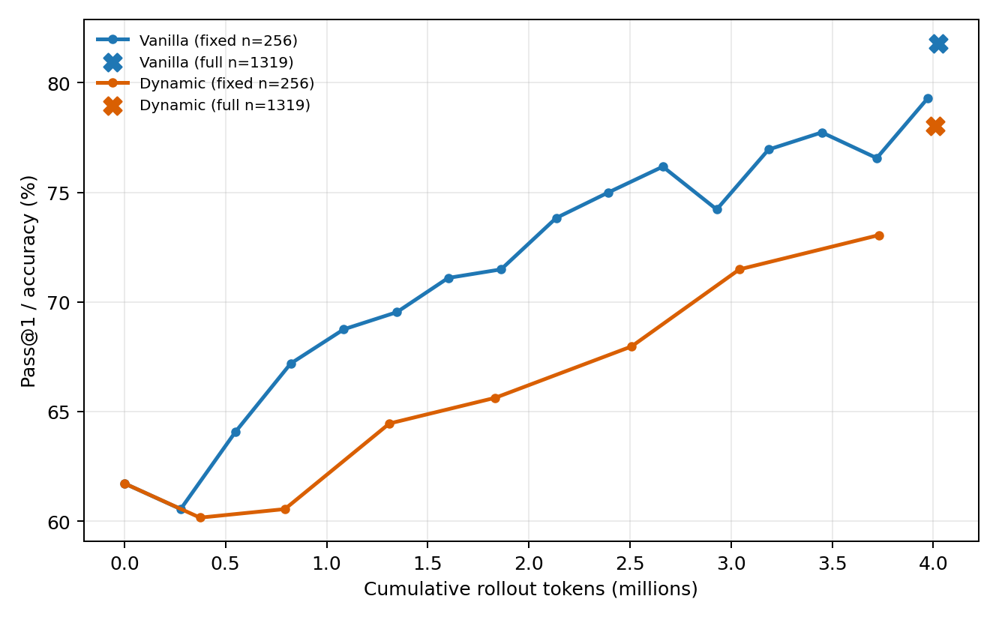
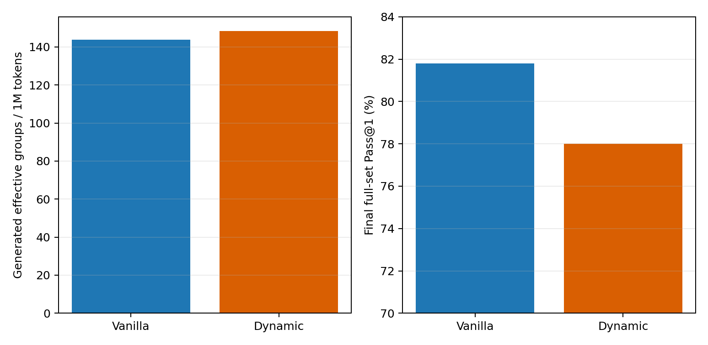

# Vanilla GRPO vs Dynamic Sampling at a fixed rollout-token budget

Both runs use Qwen2.5-Math-1.5B, raw GSM8K, seed 42, group size 8, identical
reward/loss/generation settings, and approximately four million rollout
tokens. Dynamic Sampling is the only experimental change.

## Main result

| Metric | Vanilla | Dynamic | Dynamic - Vanilla |
|---|---:|---:|---:|
| Rollout tokens | 4,023,667 | 4,009,358 | -14,309 |
| Optimizer steps | 152 | 74 | -78 |
| Effective groups used | 579 | 592 | +13 |
| Effective groups / 1M tokens | 143.90 | 147.65 | +2.61% |
| Full GSM8K Pass@1 | 81.80% | 78.01% | -3.79 points |
| Training time | 1,520 s | 1,442 s | -78 s |

Dynamic Sampling made every completed optimizer batch 100% effective, versus
47.62% effective groups inside Vanilla batches. However, this translated to
only 13 additional effective groups under the same generation budget because
1,778,411 Dynamic rollout tokens (44.36%) were spent before zero-variance
groups could be identified and discarded.

At nearly the same intermediate cost, Vanilla reached 76.56% at 3,720,545
tokens while Dynamic reached 73.05% at 3,730,529 tokens, a 3.52-point gap. On
the full 1,319-example final evaluation, Vanilla reached 81.80% and Dynamic
78.01%, a 3.79-point gap.

The final error-count difference was concentrated in formatting: Dynamic had
128 format failures versus Vanilla's 84. It had 162 parsed wrong answers
versus Vanilla's 156.

## Tokens to target accuracy

| Target | Vanilla tokens | Dynamic tokens | Dynamic / Vanilla |
|---|---:|---:|---:|
| 65% | 822,210 | 1,833,800 | 2.23x |
| 70% | 1,600,923 | 3,041,139 | 1.90x |
| 75% | 2,394,308 | Not reached | - |
| 79% | 3,972,957 | Not reached | - |

Targets use the fixed 256-example evaluation subset and the first recorded
checkpoint at or above each target.

## Research interpretation

- H1 is descriptively supported for Vanilla: zero-variance groups rose from
  28.12% in the first 20 steps to 65.00% in the last 20, mainly because of
  all-correct groups.
- H2 is supported: Dynamic raises the optimizer-batch effective ratio to 100%,
  but still pays 44.36% of its token budget for discarded generations.
- Under this fixed-token, single-seed setup, Dynamic did not improve learning
  efficiency or final accuracy. It needed 2.23x and 1.90x as many tokens to
  reach the 65% and 70% checkpoints, respectively.
- H3 and H4 remain untested. These results strengthen the motivation for a
  pre-rollout Difficulty-Aware sampler, whose purpose is to avoid generating
  many of the groups that post-rollout Dynamic Sampling later discards.

The performance result should not be generalized beyond this controlled run.
Dynamic consolidates a similar number of effective groups into about half as
many Adam updates, and it changes the prompt distribution by conditioning on
observed reward variance. Both mechanisms may contribute to the result and
should be discussed as limitations.
